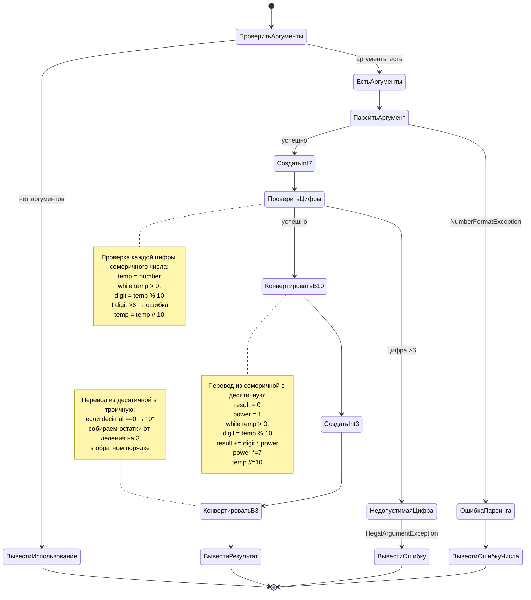

# Малков, ГабIдуллин. Вариант 12
## Лаба1
| Создайте приложение, которое осуществит перевод чисел из семеричной системы счисления в троичную. Перевод чисел выполнить «вручную» делением на основание системы счисления.

~~~
javac Convert7to3.java
java Convert7to3 NUM
~~~
java Convert7to3 3
| Число 3 (семеричная система) = 10 (троичная система)

• Какие существуют виды переменных Java, чем они отличаются друг от друга?
• Какие примитивные типы определены в Java, особенности булевского типа?
• Что называется процессом реализации ссылочного типа?
• Что делает конструктор класса? Должен ли он обязательно явно присутствовать в объявлении класса?
• Какие в существуют виды ссылочных типов?
• Что такое типы, определенные пользователем?
• Что такое стандартные типы, определенные пользователем?
• В чем особенности строковых переменных? 
• Чем массивы Java отличаются от массивов других языков, их преимущества?
• Как переменные различных видов передаются в качестве параметров методам?

