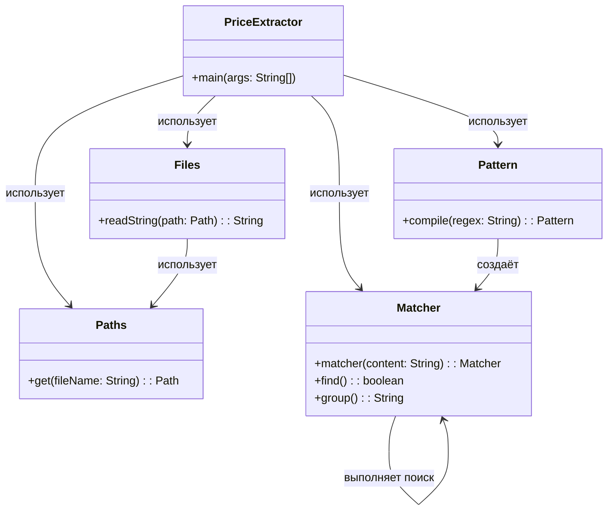

```mermaid
classDiagram
    class PriceExtractor {
        +main(args: String[])
    }
    class Files {
        +readString(path: Path): String
    }
    class Paths {
        +get(fileName: String): Path
    }
    class Pattern {
        +compile(regex: String): Pattern
    }
    class Matcher {
        +matcher(content: String): Matcher
        +find(): boolean
        +group(): String
    }

    PriceExtractor --> Files : использует
    PriceExtractor --> Paths : использует
    PriceExtractor --> Pattern : использует
    PriceExtractor --> Matcher : использует

    Files --> Paths : использует

    Pattern --> Matcher : создаёт
    Matcher --> Matcher : выполняет поиск

```
