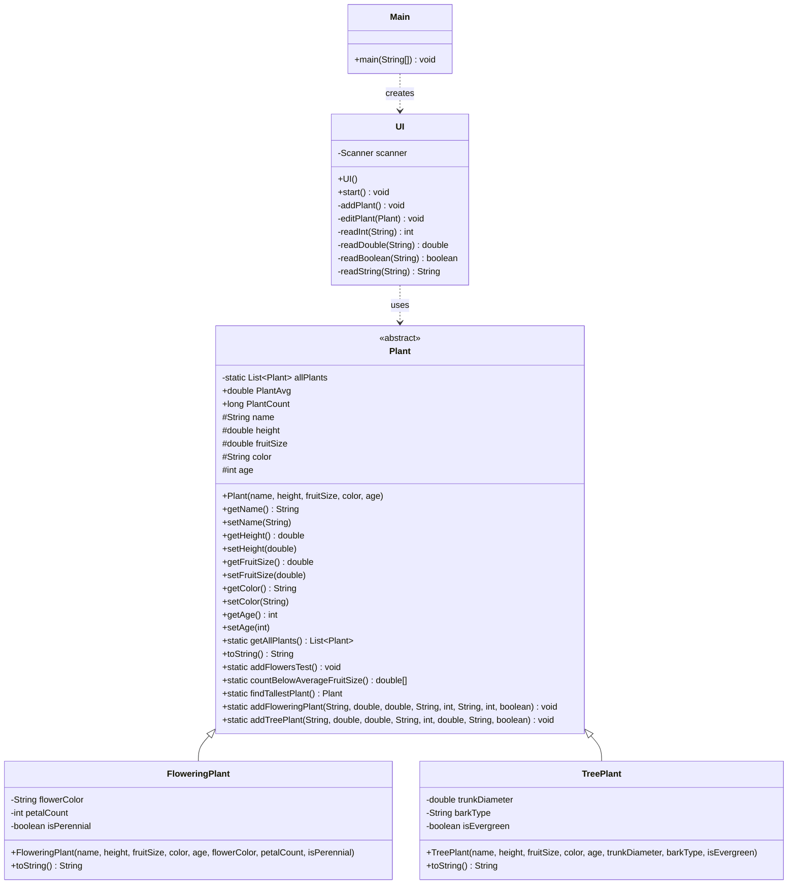

# Завершённый проект "javalabs/3"

Проект реализован в рамках задания по объектно-ориентированному программированию на языке Java. В нём была разработана функциональная модель для работы с растениями, включающая подробную иерархию классов и удобный пользовательский интерфейс.

---

## Структура проекта

```
javalabs/3/
├── src/
│   ├── model/
│   │   ├── Plant.java
│   │   ├── FloweringPlant.java
│   │   └── TreePlant.java
│   ├── ui/
│   │   └── UI.java
│   └── Main.java
├── build/
├── compile.bat
└── run.bat
```

---

## Диаграмма классов



---

## Запуск приложения

Для работы приложения выполните следующие шаги:

~~~bash
# Сначала скомпилируйте проект
compile.bat

# Затем запустите приложение
run.bat
~~~

---

## Реализованные возможности

В рамках проекта были выполнены следующие задачи:

- **Иерархия классов**  
  Созданы три класса (Plant, FloweringPlant, TreePlant), каждый из которых содержит более 5 полей и минимум 3 метода. Реализовано наследование с использованием абстрактного базового класса, который содержит общую коллекцию (статическое поле) для хранения всех объектов.

- **Анализ предметной области "Растения"**  
  На основе анализа предметной области спроектирована структура классов для работы с растениями. Программа демонстрирует следующие функции:
  - Определение самого высокого растения.
  - Подсчёт растений с размером плода ниже среднего.
  - Сортировка списка растений по их названиям.
  - Поиск растения по названию с возможностью редактирования одного из полей и выводом полной информации об объекте после внесённых изменений.

- **Пользовательский интерфейс**  
  Реализован интуитивно понятный UI, позволяющий пользователю:
  - Добавлять новые объекты растений.
  - Редактировать данные уже существующих объектов.
  - Получать полную информацию о выбранном растении после редактирования.
