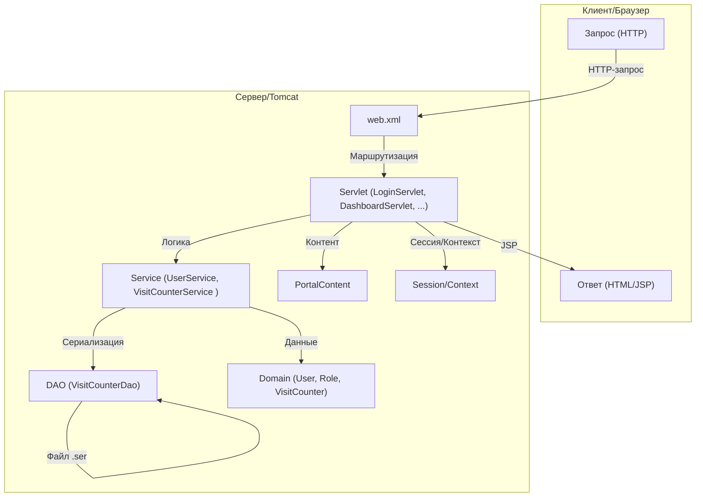
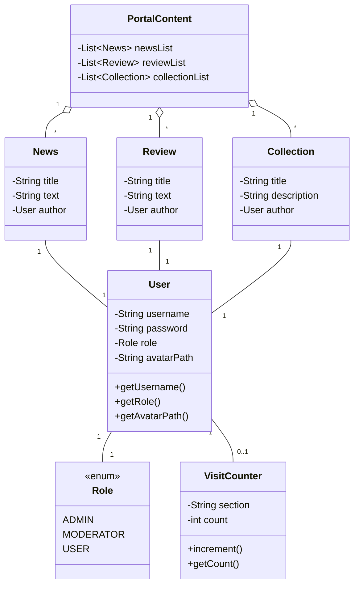
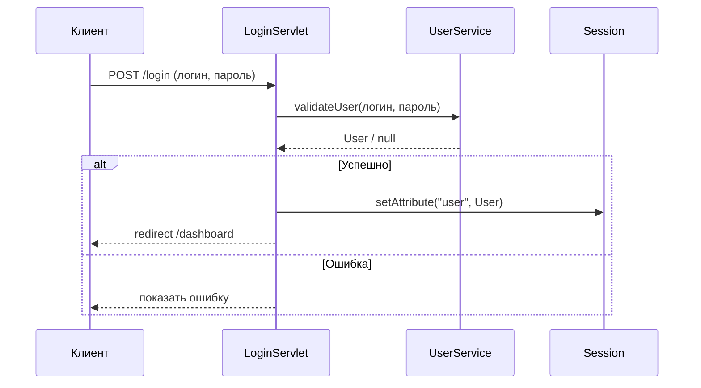

# Игровой портал на Java (Servlet/JSP)

## Описание

Данный проект — это учебный игровой портал, реализованный на Java с использованием сервлетов, JSP и стандартного API Jakarta EE (Servlet API). Портал поддерживает роли пользователей (Администратор, Модератор, Пользователь), хранит статистику посещений, позволяет добавлять новости, обзоры, подборки, а также загружать аватары пользователей.

### Основные возможности

- Аутентификация пользователей и разграничение ролей
- Личный кабинет с отображением статистики посещений
- Просмотр и добавление новостей, обзоров, подборок (для модераторов)
- Управление пользователями (для администратора)
- Загрузка и отображение аватара пользователя
- Счетчики посещений для различных разделов
- Хранение данных в памяти и сериализация счетчиков посещений

## Структура проекта

- `webapps/ROOT/WEB-INF/classes/servlet/` — сервлеты (контроллеры)
- `webapps/ROOT/WEB-INF/classes/service/` — сервисы (логика)
- `webapps/ROOT/WEB-INF/classes/domain/` — доменные объекты (User, Role, VisitCounter)
- `webapps/ROOT/WEB-INF/classes/dao/` — DAO для сериализации счетчиков
- `webapps/ROOT/WEB-INF/classes/content/` — контент портала
- `webapps/ROOT/WEB-INF/web.xml` — конфигурация сервлетов
- `webapps/ROOT/*.jsp` — представления (JSP)
- `webapps/ROOT/uploads/` — загруженные аватары

## Диаграмма взаимодействия (Mermaid)

## Диаграмма классов (Mermaid)

## Диаграмма последовательности (Mermaid)

## Быстрый старт

1. Скомпилируйте проект с помощью `compile.bat`.
2. Запустите сервер через `run.bat`.
3. Откройте [http://localhost:8080/myportal/](http://localhost:8080/myportal/) в браузере.

## Пользователи по умолчанию

- **admin / 1234** — Администратор
- **moderator / abcd** — Модератор
- **user / pass** — Обычный пользователь

## Примечания

- Все счетчики посещений сериализуются в папку `counters`.
- Загруженные аватары сохраняются в папку `uploads`.
- Для корректной работы требуется Tomcat 11+ и JDK 17+.

---
